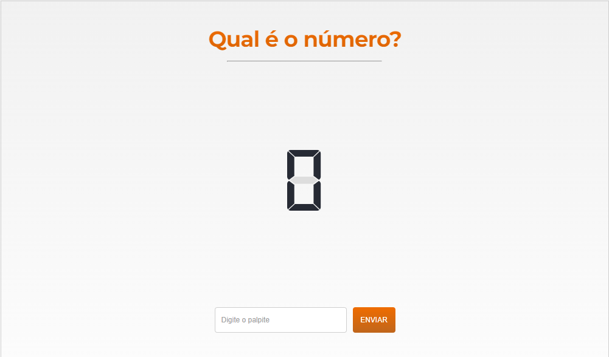

# Qual é o número?



## Tecnologias utilizadas

- [HTML](https://developer.mozilla.org/pt-BR/docs/Web/HTML)
- [CSS](https://developer.mozilla.org/pt-BR/docs/Web/CSS)
- [JavaScript](https://developer.mozilla.org/pt-BR/docs/Web/JavaScript)

## Preview

[Qual é o número?](https://luiz-gustavo0.github.io/mini-jogo/)

## Como rodar a aplicação localmente

Clone o projeto

```bash
  git clone https://github.com/luiz-gustavo0/mini-jogo.git
```

Vá até a pasta do projeto

```bash
  cd mini-jogo
```

## Author

- [@luiz-gustavo0](https://linkedin.com/in/luiz-gustavo0)
